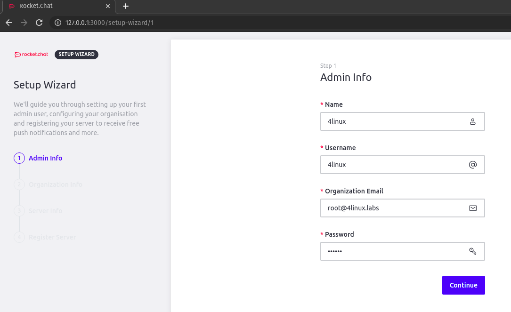
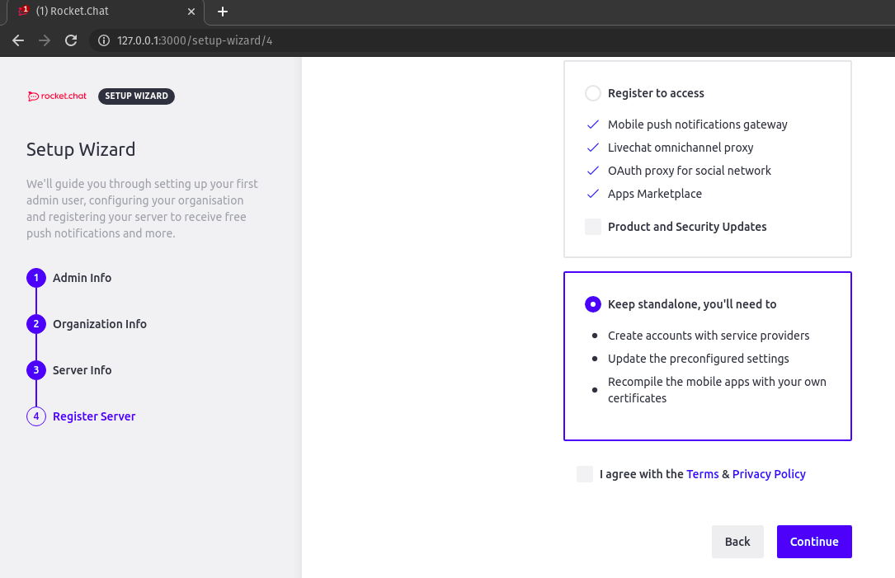
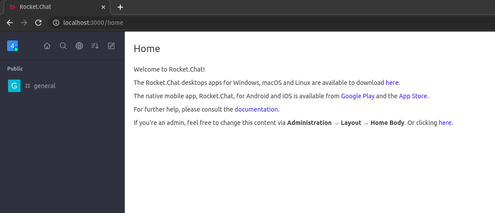

# Rocket - o quê?

## CHAT!

É muito comum nos dias de hoje encontrarmos em nosso ambiente de trabalho a necessidade de uma ferramenta de comunicação rápida para as coisas mais dinâmicas do nosso dia-a-dia, a comunicação empresarial é algo vital para que alinhamento de processos e tarefas seja feito de forma eficaz e uma ferramenta de comunicação dinâmica faz toda a diferença.
Por isso estamos aqui para falar sobre uma das melhores ferramentas que irão contribuir para a agilidade da comunicação que sua empresa precisa, o ROCKET CHAT!

## Mas Porquê?

Diversas empresas hoje possuem uma rotina muito dinâmica e uma composição de diversos softwares que geram notificações, além de pontos de comunicação com o clientes, fornecedores e colaboradores internos, e geralmente há um software para cada coisa gerando assim diversos pontos onde o analista precisa se atentar para estabelecer uma comunicação eficaz.
O Rocket Chat vai além dos programas convencionais de mensageiria, com o Rocket Chat é possível concentrar todos estes pontos de entrada em um único lugar de gerenciamento, onde o analista irá precisar simplesmente fazer parte dos canais de comunicação necessários. O Rocket Chat possibilita a integração de diversos softwares com ele, falicitando a rotina e tornando a comunicação empresiral muito mais eficaz.

### Principais Funcionalidades e Vantagens

* [x] **Omnichannel** - Permite a integração e concentração de todos os meios de comunicação existentes com seu seu cliente em um único lugar, entre eles: Email, Whatsapp e Telegram;

* [x] **Colaboração** - Integração com diversas plataformas de CI/CD e gerenciamento e tarefas como o Jenkins, Gitlab e Jira, permitindo receber notificações das alterações e jobs executados, bem como concentrar a interação dos times na resolução de um problema;

* [x] **Video-Conferência** - É possível realizar chamadas de vídeo individuais e em grupos em perfeita qualidade, o que garante a realização de reuniões e apresentações remotas;

* [x] **Open Source** - O Rocket Chat é uma ferramenta de código aberto que recebe todo apoio da comunidade, já é utilizado por mais de **mil** empresas em mais de 150 países;

* [x] **SaaS ou On-Premises** - É possivel realizar a instalação e utilização dele gratuitamente em seu ambiente, porém a Rocket Chat também possui modelo de operação como SaaS para quem deseja a praticidade de apenas utilizar todos os recursos sem se preocupar com a manutenção do ambiente;

## Vamos Testar?

Para realizar este teste do Rocket Chat nós iremos executá-lo como um container Docker, para isso você vai precisar do Docker e do Docker-Compose já instalados em sua máquina, caso ainda não tenha e queira aprender um pouco mais sobre esse tema veja os passos de [Docker](https://blog.4linux.com.br/docker-beginners/) e de [Docker-Compose](https://blog.4linux.com.br/docker-compose-explicado/) em nosso blog.

---

### Criando o compose file

> Todos os procedimentos aqui foram executados em sistema operacional Linux.

Para dar início ao nosso laboratório iremos precisar primeiramente construir o nosso compose file, para isso basta executar o comando abaixo:

```shell
cat <<EOF> docker-compose.yml
version: '3'

services:
  rocketchat:
    image: rocketchat/rocket.chat:latest
    command: >
      bash -c
        "for i in `seq 1 30`; do
          node main.js &&
          s=$$? && break || s=$$?;
          echo \"Tried $$i times. Waiting 5 secs...\";
          sleep 5;
        done; (exit $$s)"
    volumes:
      - ./uploads:/app/uploads
    environment:
      - PORT=3000
      - ROOT_URL=http://localhost:3000
      - MONGO_URL=mongodb://mongo:27017/rocketchat
      - MONGO_OPLOG_URL=mongodb://mongo:27017/local
    depends_on:
      - mongo
    ports:
      - 3000:3000

  mongo:
    image: mongo:4.0
    volumes:
     - ./data/db:/data/db
    command: mongod --smallfiles --oplogSize 128 --replSet rs0 --storageEngine=mmapv1

  # this container's job is just run the command to initialize the replica set.
  # it will run the command and remove himself (it will not stay running)
  mongo-init-replica:
    image: mongo:4.0
    command: >
      bash -c
        "for i in `seq 1 30`; do
          mongo mongo/rocketchat --eval \"
            rs.initiate({
              _id: 'rs0',
              members: [ { _id: 0, host: 'localhost:27017' } ]})\" &&
          s=$$? && break || s=$$?;
          echo \"Tried $$i times. Waiting 5 secs...\";
          sleep 5;
        done; (exit $$s)"
    depends_on:
      - mongo
EOF
```

> Este arquivo tem como base o arquivo oficial da Rocket Chat que pode ser obtido consultando sua documentação [oficial](https://docs.rocket.chat/installation/docker-containers/docker-compose).

Agora com o arquivo pronto, vamos executar o comando para criar e executar os containers:

```shell
docker-compose -p rocketchat up -d
```

Feito isso basta inserir em seu navegado o endereço "http://localhost:3000" para acessar o Rocket Chat e realizar a configuração inicial:



Insira os dados necessários e avance até a tela 04 - Register Server, e selecione a opção *"Keep standalone"*:



**PRONTO** Com isso você já verá o seu Rocker Chat pronto para uso:



---

## Próximos passos

Vimos neste laboratório como iniciar de forma básica, porém simples e rápida um cenário de utilização do Rocket Chat. Iremos aprofundar mais nas funcionalidades e integrações nos próximos posts, enquanto isso aproveite para ler os artigos já escritos que falam de [VideoConferencia](https://blog.4linux.com.br/realizando-videoconferencias-no-rocket-chat/) e [ChatBot](https://blog.4linux.com.br/chatbot-weni-e-rocket-chat-para-atendimento-ao-cliente-omnichannel-com-solucoes-open-source/) com o Rocket Chat.

Até mais!
